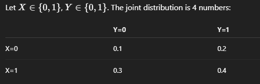
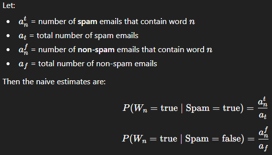
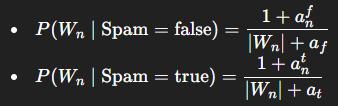
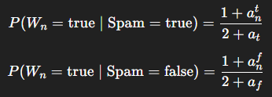

Chapter two will base its learning on a prcatical example of sorting email from spam.

2.1 Variable

Apparently we need two variables for this problem:
1. Spam: a binary variable that is true/false depending on 
    whether the email is spam or not.
2. Words (mathematically: W0, W1, ... , Wn): a set of binary variables that are true/false depending on whether a specific word is present in the email or not.

2.2 Probability

Given that a variable, say email, can have only one value at a given time,
so the value of Spam is either true or false, and that sometimes we cannot know which one of these values it has, we use probabilities to express knowledge about the information. 
P([Spam == false]) = 0.25% means that there is a 0.25% chance that the email is not spam. Consequnetly, P([Spam == true]) = 0.75%

2.3 The normalization postulate

The implication from 2.2 when a variable is either true/false is that it forces the sum of probabilities to always add up to 1.

P([Spam == true]) + P([Spam == false]) = 1

The normalization postulate property applies to any discrete variable (a variable that can take a value from a countable set) and consequently the 
probability distribution on a given variable X should neccessarily be normalized:

Σ P([X == xi]) = 1 for all values xi that X can take.

however the book will use the simpler form: Σ P(X) = 1

2.4 Conditional Probability (pg19)

When the probability of a variable depends on the value of another variable and it read probability of a given b where given mathematially is represented as a pipe |, we call it conditional probability.

Σ P(X | Y) = 1

2.5 Variable conjunction

the more specific things you assume are all true at once (ike "this bug is caused by bad input and null values"), the less likely that explanation is - unless evidence shows otherwise.

P(Spam ^ W0 ^ W1 ^ ... ^ Wn+1)

2.6 The conjunction postulate (bayes theorem)

The conjunction postulate states that the probability of a conjunction of variables is equal to the product of the conditional probabilities of each variable given all the preceding variables in the conjunction.

P(X ^ Y) = P(X) * P(Y | X)
         = P(Y) * P(X | Y)

this rule is known in the form of:
P(Y | X) = (P(Y) * P(X | Y)) / P(X)

2.7 Syllogisms

Modus Ponens: a ^ [a -> b]  => b
if a is true and if a implies b then b is true

Modus Tollens: ~b ^ [a -> b] => ~a
if b is false and if a implies b then a is false

in layman: syllogism is about logic, what must be true if something else is true: given we know prior from maths that every umber divisible by 9 is also divisible by 3, then we we get a problem saying x is divisible by 9, we can conclude that x is also divisible by 3. 

Using probabilities, we can express this as:
1. Modus Ponens: P(b | a) = 1, which means that knowing that a is true then we may be sure that b is true.
2. Modus Tollens: P(~a | ~b) = 1, which means that knowing that b is false then we may be sure that a is false.

Let's derive P(~a | ~b) = 1 from P(b | a) = 1 using normalization (prob distr of var X norm to 1) and conjunction (bayes theorem) postulates:

P(~a | ~b) = 1 - P(a | ~b)                     [normalization postulate]
          = 1 - (P(a) * P(~b | a)) / P(~b)   [conjunction postulate]
          = 1 - (P(a) * 0) / P(~b)
          = 1 - 0
          = 1

2.8 The marginalization rule
so this one is about finding the probability you care about by adding up all the ways it can happen even involving thins you don't care about.

the marginalization rule is a weird one, you have the joint probabilities of say two events:

P: "the pc turns on"
C: "the power plug is connected"

p1: plug connected ^ pc turns on 70%
p2: plug connected and pc doesn't turn on 10%
p3: plug not connected and pc turns on 0%
p4: plug not connected and pc doesn't turn on 20%

so when you want to marginalise one probability over another, say P over C, and you want to figure out the probability of the pc turning on, you make the other probability take all the possible states: thus we select
p1 and p2 where plug is connected making C be either pc doesn't turn on (p2) and pc turns on (p1)

2.9 Joint distribution page 23
The joint distribution on a set of two variables X and Y is the distribution on their conjunction: P(X^Y) which reads as the probability of X taking some value and Y taking some value which in practice is the following table over all combinations:

The idea is if you know the joint distribution you know the other 4 distributions that help you answer any probability question about X and Y:

1. P(X,Y) - joint distribution
2. P(X) - marginal distribution of X
3. P(Y) - marginal distribution of Y
4. P(X | Y) - conditional distribution of X given Y
5. P(Y | X) - conditional distribution of Y given X

2.10 Decomposition page 25

A Bayesian programmer has to specify a way to compute the joint distribution sothat it has three main qualities of being a good model, easy to compute, and easy to learn.

Apparently this is done by decomposing the joint distribution as a product of simpler distributions.

For example:
P(Spam ^ W0 ^ W1 ^ ... ^ Wn-1)
=
P(Spam) x P(W0 | Spam) x P(W1 | Spam ^ W0) x ... x P(Wn-1 | Spam ^ W0 ^ W1 ^ ... ^ Wn-2)

Then to simplify this further we just assume that the probability of appearance of a word knowing the nature of text (spam or not) is independent of the appearance of the other words.

For instance, we assume that:

P(W1 | Spam ^ W0) = P(W1 | Spam)

so that 

P(Spam ^ W0 ^ W1 ^ ... ^ Wn-1)
=
P(Spam) x ∏ P(Wn | Spam), for n=0 to N-1

So we got our classifier but because we introduced assumtions of independence, we call it a Naive Bayes Classifier.

Let's move on to tweaking the stimation aka Laplace smoothing.

2.11 Parametric forms

The main point we're trying to reach here is to get rid of the zero probability for unseen events (which in our case is where a word never appeared in spam emails before but appears now).

Currently we have the histogram form of the formula that account for what we see in the data (raw counting) but when we see something new, we get a zero probability. Thus we introduce smoothing and shift towards the parametric form of the formula which is just a tiny built in extra count so unseen things don't become impossible (i.e. zero probs).

Let's see the maths:

- what we're trying to do:
for each word Wn (like "free", "viagra", etc), we want:

P(Wn == true | Spam == true) chance of the word appearing given it's spam and  P(Wn == false | Spam == true) chance the word appears given it's not spam

And we also need the overall spam probability:

P(Spam == true) = 0.75
P(Spam == false) = 0.25

The naive counting would be the histogram model:

That formula problem comes when a^nt = 0 (word never appeared in spam emails before) making the whole probability zero.

P(Wn == true | Spam == true) = 0 / a^t = 0

We fix it by Laplace smoothing ("add-one"):

Because Wn is binary (true/false) then |Wn| can take two values (|Wn| = 2) thus:

which allows for non zero probability when word was never seen in spam: if a^nt = 0 then:
P(Wn == true | Spam == true) = (1 + 0) / (2+ a^t) > 0

2.12 Identification pg 28

Now that we have the formula we need to knwo the parameter values from data.

Two practical ways to learn them:

1. Batch learning: take a pile of emails already labeled spam/ham,
count word occurences, estimate parameters all at once.
2. Incremental - online - learning: as the user labels incoming emails, update the parameters continuously (word counts / probabilities shift over time)

Combining them solves the cold-start and personalization problem:
- start with generic defaults (from a database trained on many users) so it works "okay" immediately.
- then adapt to the individual user via incremental updates (your spam is not everyone's spam)

So the point is basically: these parameters define the classifier and the system needs a practical training strategy; start generic then personalise over time.

2.13 Specification = variables + decomposition + parametric forms

We call specification the part of the Bayesian program specified by the programmer. This part is always made of the same three subparts:

1. variables: the choise of the relevant variables for the problem
2. Decomposition: The expression of the joint probability distribution as the product of simpler distributions
3. Parametric forms: The choice of mathematical function forms of each of these distributions

2.14 Description = Specification + Identification

We call description the probabilistic model of our problem. The description is the join probability distribution on the relevant variables. it is completely specified when the eventual free parameters of the specification are given values after an identification (learning) phase.

2.15 Question pg 29

We assume the model tells us these numbers:
P(S=true) =0.2 -> 20% of emails are spam overall (the best rate)
P(W0=true | S =true)=0.9 -> if it is spam, the word shows up 90% of the time.
P(W0=true | S=false)=0.1 -> if it's not spam, the word shows up 10% of the time.

I. Description fixes the world - meaning if the three numbers above are set they will represent the rules of the "universe" and thins like P(W0=true) or P(S=true|W0=true) will be forced by the math.

II. Decomposition: compute a joint by "prior x likelihood"
Example: P(S=true ^ W0=true)=P(S)*P(W0|S) = 0.2 * 0.9

III. Marginalization: compute P(W0=true) by mixing spam and not-spam
Given: P(W0=true) = P(S=true ^ W0=true) + P(S=false ^ W0=true) = 0.2*0.9 + 0.8*0.1 = 0.18 + 0.08 = 0.26

IV. Bayes rule: update the spam probability after seeing the word
P(S=true | W0 = true) = P(S)P(W0|S)/P(W0) = 0.18/0.26= 0.692