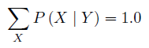

2.1 Variable

One binary variable for wheter the email is spam or not and another binary variable Wn when the nth word of the DICTIONARY is present in the spam email.

2.2 Probability

- a variable can have one and only one calue at a given time ~ however the vlaue may be unknown. Now this is strikingly how quantum bits behave thus nature known/unknown state is binary lol.

- "the probability that an email is not spam is 25%" is written as follow:
P([Spam == false]) = 0.25

2.3 The normalization postulate

- given the email is either real or spam the probabilities have to add to 1.0

This property is true for any discrete variable (not only for binary ones) and consequently the probability distribution on a given variable X should neccessarily be normalised.

X Σ ∀x∈X P ([X = x]) = 1.0

2.4 Conditional probability

- "the probability of an email to be spam given word Wn": P(Wn | [Spam == True]) 

Given Wn is binary there are two probabilities:

1. P([Wn == false] | [Spam == true]) = 0.9996

2. P([Wn == true] | [Spam == true]) = 0.0004

The shorthand expression:

2.5 Variable conjunction

The probability of two variables happening the same time:

P(Spam ^ Wn) which can take different values: { (false, false,), (false, true), (true, false), (true, true)}

2.6 The conjunction postulate (bayes theorem)
P(X^Y) is equivalent to:
1. P(X) P(Y | X)
2. P(Y) P(X | Y)

and combining 1 and 2 would give us:

P(Y | X) = P(Y) P(X | Y) / P(X)

